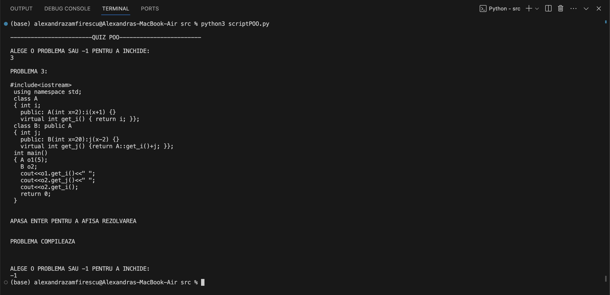

# OOP

## [OOP Project - MOOSIC](https://github.com/zamfiresq/MOOSIC)

## OOP QUIZ
This script helps you solve programs similar to those found in the exam, in order to understand how they compile and run.

### Usage
In the `src` directory, you will find the script and the 100 files containing the programs. From within the `src` directory, run:  
`python3 scriptPOO.py`

