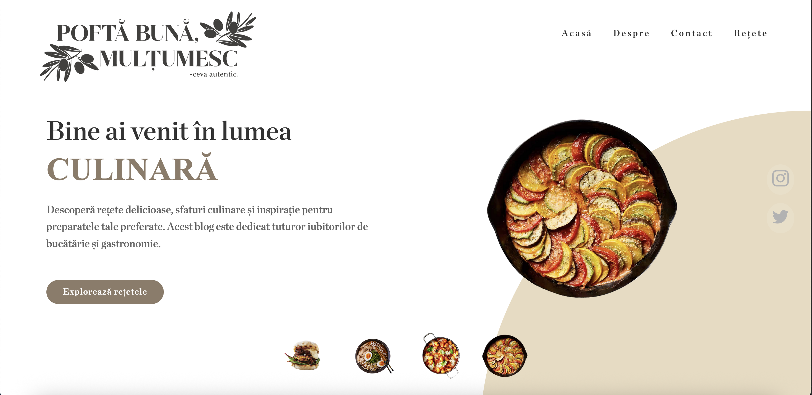

# Pofta Buna, Multumesc

## Project Overview

This project is a simple web application that allows users to search for recipes based on the ingredients they have at home. The application uses the [Edamam API](https://developer.edamam.com/edamam-recipe-api) to search for recipes based on the ingredients provided by the user.

## Structure

### Home page

### Recipes
 
